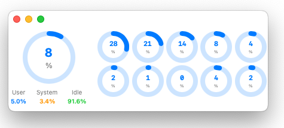
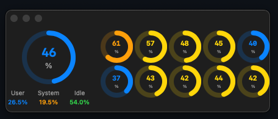

# CompactMeter-macOS

macOS向けの軽量かつコンパクトなCPU使用率監視アプリケーション。[Windows版CompactMeter](https://github.com/takke/CompactMeter)のmacOS移植版として開発されました。

<p align="center">
  
  
  
  
</p>

## 概要

CompactMeter-macOSは、リアルタイムでCPU使用率を監視する軽量なmacOSアプリケーションです。全体のCPU使用率とコア別の詳細情報を美しいグラフィカルメーターで表示します。

### 主な特徴

- 🎯 **軽量設計**: 極小ウィンドウサイズ（500x160px）
- ⚡ **高効率**: 最適化されたシステムAPI呼び出し
- 📊 **リアルタイム監視**: CPU使用率のリアルタイム表示
- 🔄 **マルチコア対応**: 個別コアの使用率を視覚化
- 🎨 **美しいUI**: SwiftUIベースのモダンなインターフェース
- 🔋 **省電力**: バッテリー消費を最小限に抑制

## スクリーンショット

### ライトモード


### ダークモード


## システム要件

- **OS**: macOS 15.0以降
- **アーキテクチャ**: Apple Silicon (ARM64)
- **メモリ**: 最小16MB

## インストール

### ビルドからインストール

1. リポジトリをクローン
```bash
git clone https://github.com/username/CompactMeter-macOS.git
cd CompactMeter-macOS
```

2. Xcodeでプロジェクトを開く
```bash
open CompactMeter-macOS.xcodeproj
```

3. ビルドして実行
```bash
xcodebuild -project CompactMeter-macOS.xcodeproj -scheme CompactMeter-macOS -configuration Release build
```

## 使用方法

1. アプリケーションを起動すると、コンパクトなウィンドウが表示されます
2. 左側に全体のCPU使用率が円形メーターで表示されます
3. 右側に各CPUコアの使用率が小さな円形メーターで表示されます
4. メーターの色は使用率に応じて変化します：
   - 🔵 青: 0-40%
   - 🟡 黄: 40-60%
   - 🟠 オレンジ: 60-80%
   - 🔴 赤: 80-100%

## 技術仕様

### アーキテクチャ

```
UI Layer (SwiftUI Views)
   ↓
ViewModel Layer (ObservableObject)
   ↓
Repository Layer (データ取得抽象化)
   ↓
Data Source Layer (システムAPI呼び出し)
```

### 主要技術スタック

- **言語**: Swift 5.5+
- **UIフレームワーク**: SwiftUI + AppKit
- **非同期処理**: async/await + Combine
- **グラフィックス**: Core Graphics + Core Animation
- **データ永続化**: UserDefaults + Property Wrappers
- **システムAPI**: Darwin (host_processor_info, host_statistics)

### パフォーマンス最適化

- **単一API呼び出し**: 全体とコア別CPU使用率を同時取得
- **アニメーション軽量化**: 1%未満の変化をフィルタリング
- **デバウンス処理**: 100msの更新間隔制御
- **メモリ最適化**: 効率的な配列管理
- **監視間隔**: 2秒間隔でリソース消費を最小化

## 開発コマンド

```bash
# プロジェクトを開く
open CompactMeter-macOS.xcodeproj

# デバッグビルド
xcodebuild -project CompactMeter-macOS.xcodeproj -scheme CompactMeter-macOS -configuration Debug build

# リリースビルド
xcodebuild -project CompactMeter-macOS.xcodeproj -scheme CompactMeter-macOS -configuration Release build

# テスト実行
xcodebuild test -project CompactMeter-macOS.xcodeproj -scheme CompactMeter-macOS
```

## プロジェクト構造

```
CompactMeter-macOS/
├── App/                    # アプリケーション基盤
├── Views/                  # UI コンポーネント
│   ├── Meters/            # メーター表示コンポーネント
│   └── Components/        # 共通UIコンポーネント
├── ViewModels/            # ビジネスロジック
├── Services/              # データサービス
│   ├── Repositories/      # データアクセス抽象化
│   └── DataSources/       # システム情報取得
├── Models/                # データモデル
└── Resources/             # リソースファイル
```

## 開発ロードマップ

### ✅ Phase 1: 基本機能 (完了)
- [x] プロジェクト初期化
- [x] 基本メニューバーアプリ
- [x] システムメトリクス取得
- [x] 独立ウィンドウアプリへの変更

### ✅ Phase 2: UI/UX改善 (完了)
- [x] メーター描画とアニメーション
- [x] マルチコアCPU表示
- [x] コンパクトなUI設計
- [x] パフォーマンス最適化

### 🚧 Phase 3: 機能拡張 (予定)
- [ ] メモリ使用率監視
- [ ] ネットワーク使用量監視
- [ ] ディスクI/O監視
- [ ] カスタマイズ可能な設定

### 📦 Phase 4: 配布準備 (予定)
- [ ] App Sandboxing対応
- [ ] Developer ID Application署名
- [ ] App Store配布準備
- [ ] 自動更新機能

## 貢献

プロジェクトへの貢献を歓迎します！

1. フォークを作成
2. フィーチャーブランチを作成 (`git checkout -b feature/amazing-feature`)
3. 変更をコミット (`git commit -m 'Add amazing feature'`)
4. ブランチにプッシュ (`git push origin feature/amazing-feature`)
5. プルリクエストを作成

## ライセンス

このプロジェクトはMITライセンスの下で公開されています。詳細は[LICENSE](LICENSE)ファイルをご覧ください。

## 作者

- **開発者**: Hiroaki Takeuchi
- **プロジェクト開始**: 2025年6月

## 謝辞

- Windows版CompactMeterの開発者に感謝
- SwiftUIコミュニティのサポートに感謝
- macOS開発エコシステムに感謝

---

<p align="center">
Made with ❤️ for macOS developers
</p>